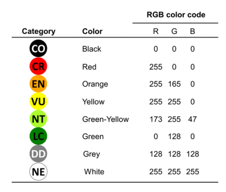

---
output:
  md_document:
    variant: markdown_github
---

<!-- README.md is generated from README.Rmd. Please edit that file -->

```{r, echo = FALSE}
knitr::opts_chunk$set(
  collapse = TRUE,
  comment = "#>",
  fig.path = "figure/",
  fig.height = 1
)
```

# IUCN Palette

Make your plots with the official colours used by the IUCN according to their style guide.   
NOTE: This package is made for aligning graphics with the IUCN official category colours, but is not endorsed in any way by the IUCN.

## Installation


```r
devtools::install_github("timcashion/IUCNpalette")
```

## Usage

```{r, palettes_dummy}
library("IUCNpalette")
# See all palettes
names(iucn_palettes)
```


### All

```{r, full-categories}
iucn_palette(category="All")
```

### Remove some categories

```{r, some-categories}
iucn_palette(category="All", exclude=c("DD", "NE", "CO"))
```


### Single category
```{r, single-category}
iucn_palette(category="EN")
```


    
Source: Bland et al., 2016. 

## References

- Bland, L.M., Keith, D.A., Miller, R.M., Murray, N.J. and Rodríguez, J.P. (eds.) (2016).
Guidelines for the application of IUCN Red List of Ecosystems Categories and
Criteria, Version 1.0. Gland, Switzerland: IUCN. ix + 94pp. https://portals.iucn.org/library/sites/library/files/documents/2016-010.pdf


